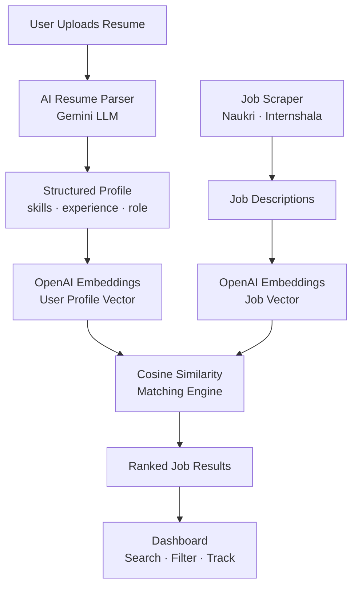
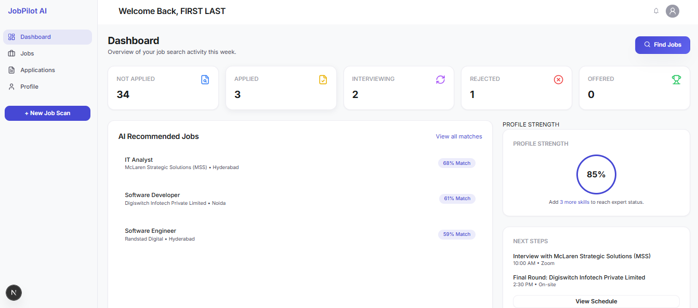
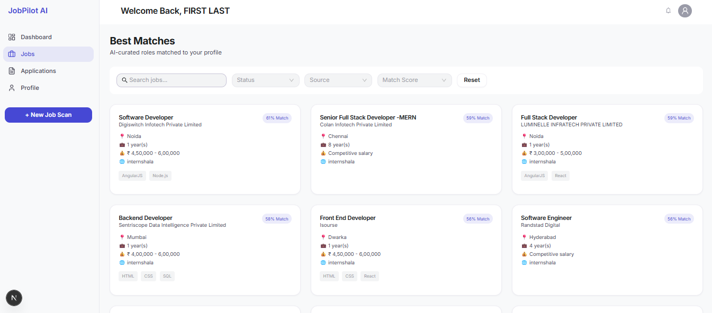
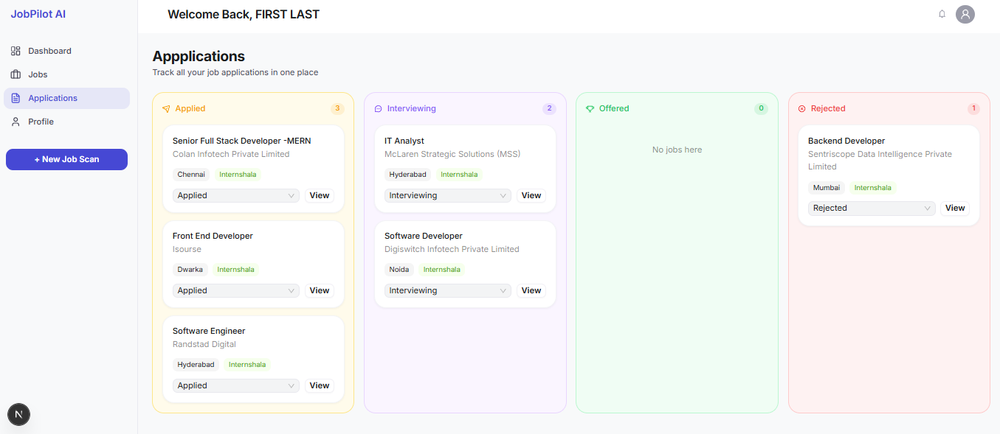
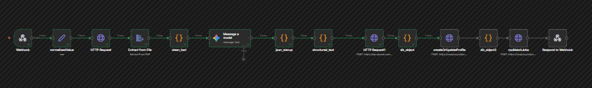
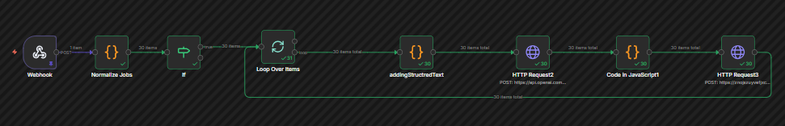

# 🚀 JobPilot AI

> **Scrapes jobs from Naukri & Internshala, parses your resume with AI, and ranks the best-matching roles using vector embeddings — all in one automated pipeline.**

**Status:** 🚧 Active Development

---

## 📌 Problem

Applying for jobs today is **fragmented, repetitive, and inefficient**.

* Jobs are scattered across platforms like LinkedIn, Naukri, Internshala
* Hard to find roles that truly match your profile
* Resume tailoring is manual and time-consuming
* No centralized way to track applications

This leads to:

* Low response rates
* Missed opportunities
* Wasted time

---

## 💡 Solution

**JobPilot AI** automates and optimizes the entire job search workflow.

It helps users:

* Discover relevant jobs across platforms
* Match jobs intelligently using AI
* Personalize resumes based on job descriptions
* Track applications in one place

---

## ⚙️ How It Works (Architecture Flow)

1. **User Onboarding**

   * User signs up
   * Uploads resume

2. **Resume Processing**

   * Resume is parsed using AI (LLM-based extraction)
   * Structured data is generated (skills, experience, etc.)
   * Embeddings are created using OpenAI

3. **Job Ingestion**

   * Jobs are scraped from platforms (Naukri, Internshala)
   * Job descriptions are processed
   * Embeddings are generated for each job

4. **Smart Matching Engine**

   * Cosine similarity is applied between:

     * User profile embeddings
     * Job description embeddings
   * Jobs are ranked based on relevance

5. **User Interface**

   * Users can search and filter jobs
   * View best-matched roles
   * Track application status

---

## 🧠 Key Features

* 🔍 **Automated Job Scraping**
* 🤖 **AI Resume Parsing**
* 📊 **Semantic Job Matching (Embeddings + Cosine Similarity)**
* 📝 **Resume Personalization (Planned)**
* 📌 **Application Tracking Dashboard**
* 🔔 **Notifications (Planned)**

---

## 🏗️ Tech Stack

* **Frontend:** Next.js / React
* **Backend:** Node.js / n8n workflows
* **Database:** Supabase (Postgres + pgvector)
* **AI/ML:**

  * OpenAI (Embeddings)
  * Gemini AI (Resume Parsing)
* **Automation:** n8n
* **Deployment:** Vercel

---

## 📸 Screenshots

> *(Add your UI screenshots here)*

🧭 Dashboard

Central hub to view jobs, track applications, and manage your job search workflow.

🔍 Job Listings (Scraped Jobs)

Jobs automatically scraped from platforms like Naukri and Internshala with filtering capabilities.

📌 Application Tracker

Track job applications across different stages (Applied, Interview, Rejected) in one place.

🤖 AI Resume Parsing Workflow (n8n)

Automated pipeline that extracts structured data (skills, experience) from resumes using LLMs and stores it for further processing.

⚡ Job Embedding & Matching Pipeline (n8n)

Jobs are processed and converted into vector embeddings, enabling semantic matching using cosine similarity with user profiles.
---

## 🚧 Status

| Component | Status |
|---|---|
| Job Scraper (Naukri · Internshala) | ✅ Working |
| AI Resume Parsing (Gemini) | ✅ Working |
| Embedding & Matching Engine | ✅ Working |
| Dashboard & Application Tracker | 🚧 In Progress |
| AI Resume Personalization | 🔜 Planned |
| AI Agent Layer | 🔜 Planned |

---

## 🔮 Future Improvements

* Multi-platform job scraping (LinkedIn, Indeed, etc.)
* Advanced resume tailoring per job
* Email/Slack job alerts
* Interview preparation assistant
* Chrome extension for quick apply

---

## 🧑‍💻 Author

Built as part of an AI-driven job automation project to demonstrate:

* Full-stack development
* AI integration
* Workflow automation
* Real-world problem solving

---

## ⭐️ Support

If you find this useful, consider starring the repo!
=======
## Project Overview
  - AI-powered job automation platform that scrapes jobs, stores them, matches resumes using embeddings, and notifies users.

## Tech Stack
- **n8n** (workflow automation)
- **Apify** (job scraping)
- **Supabase** (Postgres DB + Auth)
- **Next.js** (Frontend)
- **Node.js / Express** (API layer)
- **OpenAI / Gemini** (AI matching)
- **Docker** (deployment)

## Architecture Flow
= Apify → n8n → Supabase → Backend API → Frontend → AI Matching → Notifications
>>>>>>> 82a7eaef7142873d3582896e28ab5b0bc0b9c513
